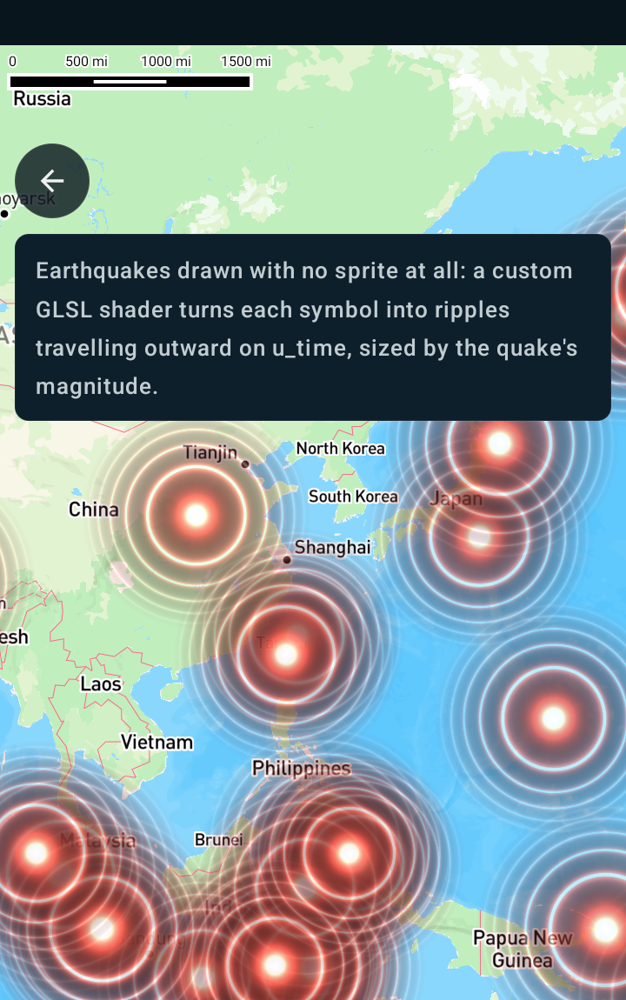

Custom earthquake symbols using a shader
========================================

Android port of the MapsGL JS example
[Custom earthquake symbols using a shader](https://www.xweather.com/docs/mapsgl/examples/custom-earthquake-shader).

> Published as
> [MapsGL Android → Examples → Custom earthquake symbols using a shader](https://www.xweather.com/docs/mapsgl-android-sdk/examples/custom-earthquake-shader).
> That page is the source of truth; this copy is here so the demo repo stands alone.

This example customizes the symbols displayed by the earthquakes layer using a custom fragment
shader. Each quake is drawn procedurally — there is no sprite involved at all — and the shader turns
the symbol's quad into concentric waves that travel outward over time. Quad size comes from the
quake's magnitude.

Custom shaders can be used for symbol layer types to create a unique animated visual effect for
each symbol based on the feature's data and properties.

Runnable source: [`CustomEarthquakeShaderActivity.kt`](../../app/src/main/java/com/example/mapsgldemo/docExamples/CustomEarthquakeShaderActivity.kt)
(**Documentation Examples → Custom earthquake symbols using a shader**).



---

## Drawing with no icon image

`IconPaint.shader` normally recolours a sprite. Set it with **no** `IconPaint.source` and the
renderer takes its icon-less path instead: it still lays the quad out from `IconPaint.size` /
`IconPaint.iconSize`, but hands the fragment stage a clean `0..1` quad coordinate in `v_tex` rather
than an atlas rectangle.

That is what makes `v_tex` usable as the JS example's `vUv`, and **it only holds while no image is
set** — give the layer an icon and `v_tex` goes back to being atlas coordinates, and the ripple
maths silently draws the wrong thing.

## Shader language version

This example's fragment shader declares `#version 300 es`. That is a deliberate choice and it is
worth understanding before copying it.

The fragment shader is only half the program: `linkSymbolProgram` compiles the SDK's own symbol
**vertex** shader against your source verbatim, and that vertex shader is fixed at
`#version 310 es`. The renderer does not rewrite your version directive, so declaring `300 es`
produces a mixed-version program. That links only where the driver's shading language is
**ESSL 3.20 or newer**, because ESSL 3.20 is what permits 300 es, 310 es and 320 es shaders to be
linked together.

| Device shading language | `#version 300 es` fragment |
| --- | --- |
| ESSL 3.20+ (OpenGL ES 3.2) | links and renders normally |
| ESSL 3.10 (OpenGL ES 3.1) | link rejected, SDK falls back to the built-in icon shader |

The fallback is the dangerous case: with no icon image there is nothing for the built-in shader to
draw, so the quakes simply do not appear, with only a log line explaining why. **`310 es` matches
the vertex stage on every ES 3.1+ device and is the safer default for shipping code.**

Verified on an Adreno 650 reporting `OpenGL ES GLSL ES 3.20` — identical output to the 310 es
version, no fallback logged.

Two things this does *not* buy you. Nothing in the effect needs ES 3.1 — no `fwidth`, no compute,
no 3.1-only builtins — so `310 es` costs nothing here. And `300 es` does not widen device support,
because the vertex stage still requires ES 3.1 and so the whole GL symbol path does too. Reaching
OpenGL ES 3.0 hardware would need an SDK change, not a shader-version change.

## The shader interface

The symbol vertex stage hands your fragment shader this interface, in GLSL ES 3.x rather than the
WebGL1 GLSL ES 1.00 the web SDK uses:

```glsl
#version 300 es
precision highp float;                  // required - the vertex stage uses highp
uniform sampler2D u_sdfTex;             // glyph / SDF atlas
uniform sampler2D u_rasterTex;          // sprite atlas
uniform vec4  u_haloColor;
uniform float u_haloWidth;
uniform int   u_raster_mode;            // != 0 for sprite icons, 0 for SDF
uniform float u_time;                   // seconds since process start
in vec2  v_tex;                         // 0..1 across the quad when no icon image is set
in vec4  v_color;                       // .a carries the collision fade - always respect it
in float v_factor;                      // per-feature IconPaint.factor, default 1.0
in float v_random;                      // stable per-instance random, for de-syncing effects
out vec4 fragColor;
```

If your shader fails to compile, the SDK logs the driver's message and falls back to the built-in
icon shader rather than taking the app down — so a typo shows up as "the effect just isn't there".

## Porting the web shader

Translating the JS example's shader needed five changes and nothing else:

| JS (`paint.symbol.shader`) | Android (`IconPaint.shader`) |
| --- | --- |
| `varying vec2 vUv` | `in vec2 v_tex` (0..1 only with no icon image) |
| `varying float vFactor` | `in float v_factor`, from `IconPaint.factor` |
| `varying float vRandom` | `in float v_random` |
| `uniform float time` | `uniform float u_time` |
| `gl_FragColor = …` | `out vec4 fragColor` |
| `precision mediump float` | `precision highp float` (the vertex stage uses highp) |

Two web-only details are dropped rather than translated:

1. **`#extension GL_OES_standard_derivatives`** — `fwidth` is core in ES 3.x, so requesting the
   extension is a compile error rather than a harmless no-op.
2. **`gl_FragColor.rgb *= gl_FragColor.a`** — the web layer blends premultiplied. Android's symbol
   renderer blends `GL_SRC_ALPHA, GL_ONE_MINUS_SRC_ALPHA`, so premultiplying here darkens the
   result twice. This is the one difference that looks like a rendering bug rather than a syntax
   error if you copy a web shader across unchanged.

The JS `resolution` and `dpr` uniforms have no Android counterpart. This effect never reads them,
so nothing is lost; an effect that needs pixel size should derive it from the quad instead.

One deliberate change to the wave maths: the JS example's alpha is `1.0 - d`, which goes **negative**
outside the quad's inscribed circle. A negative alpha reaching `GL_ONE_MINUS_SRC_ALPHA` brightens
the basemap in the quad's corners instead of leaving it alone, so the port clamps with
`max(0.0, 1.0 - d)` and discards near-zero fragments.

## Keeping it animating

`animated: true` in the JS paint has **no direct Android equivalent**, and a shader that samples
`u_time` does not by itself keep the map painting: once the camera settles and the timeline is
paused, Mapbox stops calling the renderer.

The renderer treats a symbol layer as continuously animated when `IconPaint.spin` is set, so this
example sets `spin` with `spinDegreesPerSecond` at `0` — frames keep arriving and `u_time` keeps
advancing, while the vertex stage's rotation term stays zero:

```kotlin
paint.icon.spin = true
paint.icon.spinDegreesPerSecond = 0f
```

`spin` is read when the layer is added, so it must be set **before** `addWeatherLayer`.

Measured on a Galaxy S20 (Adreno 650) with the camera idle and the timeline paused, sampling a
ripple-only crop once per second:

| | pixels changing between frames |
| --- | --- |
| `spin = true`, `spinDegreesPerSecond = 0f` | 60–64% |
| `spin` unset | 0.00% (max channel delta 0 — completely frozen) |

## Sizing from magnitude

The JS example sets `size: { width: s, height: s }` where
`s = 20 + 100 * (report.mag / 10)`, in JS icon pixels.

Android splits that into two properties: `IconPaint.iconSize` is the pixel box but takes constants
only, while `IconPaint.size` is a *multiplier* and accepts an expression. Dividing the JS pixel
expression by `IconSize.JS_REFERENCE_WIDTH_PX` (40, the width Android measures multipliers against)
converts one into the other and lands on the same pixel size per feature:

```kotlin
// JS: ['+', 20, ['*', 100, ['/', ['coalesce', ['get', 'report.mag'], 1], 10]]]
val magnitudeScale: Expression = Expression.divide(
    Expression.add(
        20.0,
        Expression.multiply(
            100.0,
            Expression.divide(
                Expression.coalesce(listOf(Expression.get("report.mag"), 1.0)),
                10.0,
            ),
        ),
    ),
    40.0,
)
paint.icon.size = StyleValue.Expression(magnitudeScale)
```

`coalesce` covers quakes that report no magnitude, which would otherwise size to nothing.

## Attaching a symbol layer to the earthquakes source

`WeatherService.Earthquakes` pairs the earthquakes GeoJSON with a **circle** layer, matching the
default product, so it cannot carry an icon shader. The JS example sidesteps this with
`type: 'symbol', source: 'earthquakes'`; on Android the equivalent is to reuse
`WeatherSource.earthquakes` under your own `SymbolLayerDescriptor`, which keeps the same data and
the same `report.*` feature properties:

```kotlin
private class EarthquakeRippleConfiguration(
    service: WeatherService,
) : WeatherLayerConfiguration<GeoJSONSourceDescriptor, SymbolLayerDescriptor> {
    override val code: LayerCode = LayerCode.EARTHQUAKES
    override val source: GeoJSONSourceDescriptor = WeatherSource.earthquakes(service)
    override val layer: SymbolLayerDescriptor = SymbolLayerDescriptor(
        id = "climate.earthquakes.ripple",
        source = source.id,
        paint = SymbolLayerPaint(icon = IconPaint(), text = emptyList()),
    )
    override var presentation: Presentation? = null
    override var legend: Legend? = null
}
```

## Adding the layer

```kotlin
val config = EarthquakeRippleConfiguration(controller.service)
val paint = config.layer.paint

paint.icon.shader = RIPPLE_SHADER
paint.pitchWithMap = true                       // JS parity; also the Android default
paint.icon.size = StyleValue.Expression(magnitudeScale)

paint.icon.spin = true                          // keeps frames coming; see above
paint.icon.spinDegreesPerSecond = 0f

controller.addWeatherLayer(config)
```

Changing icon paint *after* the layer is on the map needs
`MapboxMapController.refreshGlVectorLayerPaint`. Setting it before `addWeatherLayer`, as above,
needs no refresh.

## The ported shader

```glsl
#version 300 es
precision highp float;

uniform sampler2D u_sdfTex;
uniform sampler2D u_rasterTex;
uniform vec4  u_haloColor;
uniform float u_haloWidth;
uniform int   u_raster_mode;
uniform float u_time;

in vec2  v_tex;
in vec4  v_color;
in float v_factor;

out vec4 fragColor;

vec3 hsb2rgb(in vec3 c) {
    vec3 rgb = clamp(abs(mod(c.x * 6.0 + vec3(0.0, 4.0, 2.0), 6.0) - 3.0) - 1.0, 0.0, 1.0);
    rgb = rgb * rgb * (3.0 - 2.0 * rgb);
    return c.z * mix(vec3(1.0), rgb, c.y);
}

void main() {
    // With no icon image bound, v_tex is the quad's own 0..1 coordinate - the JS example's vUv.
    vec2 pos = v_tex;
    float t = u_time;

    float dist = length(2.0 * pos - 1.0) * 2.0;
    vec2 p = vec2(dist);

    float r = length(p) * 0.9;
    vec3 color = hsb2rgb(vec3(0.03, 0.7, 0.6));

    float a = pow(r, 3.0);
    float b = sin(r * 1.8 - 1.6);
    float c = sin(r - 0.010);
    float s = sin(a - t * 2.0 + b) * c;

    color *= abs(1.0 / (s * 1.8)) - 0.01;

    // Fade to nothing at the quad's inscribed circle; max() keeps alpha out of negatives.
    float d = length(2.0 * pos - 1.0);
    float alpha = max(0.0, 1.0 - d);

    // v_color.a carries the collision fade. No premultiply: this renderer does not blend
    // premultiplied.
    fragColor = vec4(color, alpha * v_color.a);
    if (fragColor.a < 0.01) discard;
}
```

The wave maths is unchanged from the JS example, which itself adapts
[Shadertoy ldycR3](https://www.shadertoy.com/view/ldycR3). Only the shader interface moved.

## Reusable noise chunks

Custom symbol shaders support the same `#include <name>` chunk mechanism as the web SDK, so effects
that need noise do not have to re-type it:

```glsl
#include <fbm>
```

`fbm` (value-noise fractal Brownian motion, as used by the web `fires-fx` example) is the chunk
currently registered. An unresolvable name is left as a GLSL comment, so the mistake surfaces as a
clear compile error at the reference site rather than silently disappearing.
