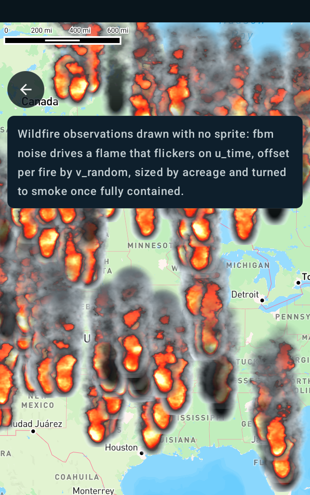

Custom fire symbols using a shader
==================================

Android port of the MapsGL JS example
[Custom fire symbols using a shader](https://www.xweather.com/docs/mapsgl/examples/custom-fires-shader).

> Published as
> [MapsGL Android → Examples → Custom fire symbols using a shader](https://www.xweather.com/docs/mapsgl-android-sdk/examples/custom-fires-shader).
> That page is the source of truth; this copy is here so the demo repo stands alone.

This example customizes the symbols displayed by the `fires-obs` layer using a custom fragment
shader to create an animated fire effect. Every fire observation draws procedurally — no sprite —
with fractal noise driving the flicker, sized from the fire's acreage, and turned to smoke once it
is fully contained.

Runnable source: [`CustomFiresShaderActivity.kt`](../../app/src/main/java/com/example/mapsgldemo/docExamples/CustomFiresShaderActivity.kt)
(**Documentation Examples → Custom fire symbols using a shader**).



Read [Custom earthquake symbols using a shader](custom-earthquake-shader.md) first — it covers the
icon-less shader path, the `v_tex` / `u_time` interface, the non-premultiplied blend, and the
`spin` trick for keeping frames coming. This page covers only what the fire effect adds.

---

## Reusable noise via `#include <fbm>`

The flame needs fractal Brownian motion. The SDK ships the same shader-chunk registry the web SDK
uses, so the JS example's `#include <fbm>` line ports across unchanged and resolves to the
identical value-noise implementation:

```glsl
#include <fbm>
```

`fbm` is the chunk currently registered. An unresolvable name is left as a GLSL comment, so a typo
surfaces as a clear compile error at the reference site rather than silently disappearing.

## `v_random` de-syncs the fires

`u_time` alone would make every fire on the map flicker in lockstep. The JS shader offsets each
instance with `vRandom`; on Android that is `v_random`, a stable per-instance value the symbol
vertex stage provides for free:

```glsl
float t = (u_time + v_random * 10.0) * 0.5;
```

## `v_factor` carries percent contained

`IconPaint.factor` feeds `v_factor`, and this example drives it from `report.perContained`:

```kotlin
// JS: ['/', ['coalesce', ['get', 'report.perContained'], 0], 100]
paint.icon.factor = StyleValue.Expression(
    Expression.divide(
        Expression.coalesce(listOf(Expression.get("report.perContained"), 0.0)),
        100.0,
    ),
)
```

The shader then tests `v_factor == 1.0` and swaps flame colour for smoke, so a fully contained fire
reads differently without needing a second layer.

## `fwidth` needs no extension

The JS shader requests `GL_OES_standard_derivatives` so it can call `fwidth`. In GLSL ES 3.x
`fwidth` is core, so that `#extension` line is a compile error rather than a harmless no-op, and is
simply dropped. The `fwidth` call itself ports across untouched.

## Orientation and placement

The flames are screen-upright and their base sits on the fire:

```kotlin
paint.pitchWithMap = false     // JS parity - do not tilt into the map plane
paint.rotateWithMap = false    // JS parity - do not swing with bearing
paint.icon.anchor = StyleValue.Constant(Anchor.BOTTOM)
```

### Keep the JS Y-flip

`v_tex.y` grows **downward** on screen: the vertex stage sets `v_tex = (a_quad + 1) / 2`, and
billboard mode maps `a_quad.y = +1` to a negative NDC offset, so `v_tex.y = 1` is the quad's bottom
edge.

That is the *same* orientation as the JS `vUv`, so the example's flip is ported verbatim:

```glsl
vec2 uv = vec2(v_tex.x, 1.0 - v_tex.y);
```

Drop it and the effect still renders — but with the flame body at the top and the smoke falling
downward, which reads as plausible until you look closely. It is the easiest mistake to make in
this port.

## Size: one expression per axis

The JS example sizes width and height **independently** per feature:

```
area      = max(1, coalesce(report.areaAC, 0))
contained = coalesce(report.perContained, 0)
f         = area * (contained == 100 ? 0.75 : 1) / 10000

width  = min(80,  round(30 + 40 * f))
height = min(130, round(40 + 80 * f))
```

so a fire's aspect ratio changes with its size — 30×40 (0.75) when small, 80×130 (0.62) when large.

`IconPaint.iconSize` carries constants only, and `IconPaint.size` is a single multiplier applied to
both axes, so neither can express that on its own. `IconPaint.iconWidth` and `IconPaint.iconHeight`
can: each resolves from its own expression per feature, so both JS formulas port across directly.

```kotlin
paint.icon.iconWidth = StyleValue.Expression(
    Expression.min(
        80.0,
        Expression.round(Expression.add(30.0, Expression.multiply(40.0, JS_SIZE_F))),
    ),
)
paint.icon.iconHeight = StyleValue.Expression(
    Expression.min(
        130.0,
        Expression.round(Expression.add(40.0, Expression.multiply(80.0, JS_SIZE_F))),
    ),
)
```

Resolution precedence is `iconWidth`/`iconHeight` → `iconSize` → `size` over the 40px reference
width. Both per-axis values must be set for that path to apply; with either unset, sizing behaves
exactly as it did before these properties existed.

`IconPaint.size` still multiplies whatever the two resolve to, which is what this demo's
flame-size slider drives — the JS pixel formulas stay untouched underneath it.

Sizes resolved on a device at zoom 3, one pair per fire:

| fire | width × height |
| --- | --- |
| smallest (`f = 0`) | 30 × 40 |
| mid | 36 × 52, 43 × 67 |
| largest (`f ≥ 1.125`) | 80 × 130 |

The only divergence from JS is at exact `.5` rounding boundaries, where the expression evaluator
rounds down and JavaScript's `Math.round` rounds up — a 1px difference on one axis.

## Watch the layer id

The renderer special-cases the id `climate.fire_obs.icons`, forcing an 18–40px square derived from
`report.areaAC` so the built-in `fires-obs-icons` product matches its JS counterpart. Reusing that
id here would silently override everything above, so this layer uses its own id:

```kotlin
override val layer: SymbolLayerDescriptor = SymbolLayerDescriptor(
    id = "climate.fire_obs.flames",
    source = source.id,
    paint = SymbolLayerPaint(icon = IconPaint(), text = emptyList()),
)
```

## Attaching a symbol layer to the fires source

`WeatherService.FiresObs` pairs the `fires-obs` vector tiles with a circle layer, so it cannot
carry an icon shader. Reusing `WeatherSource.fires_obs` under your own `SymbolLayerDescriptor`
keeps the same tiles and the same `report.*` properties — the Android equivalent of the JS
example's `type: 'symbol'` override.

```kotlin
private class FireFlameConfiguration(
    service: WeatherService,
) : WeatherLayerConfiguration<VectorSourceDescriptor, SymbolLayerDescriptor> {
    override val code: LayerCode = LayerCode.FIRES_OBS
    override val source: VectorSourceDescriptor = WeatherSource.fires_obs(service)
    override val layer: SymbolLayerDescriptor = SymbolLayerDescriptor(
        id = "climate.fire_obs.flames",
        source = source.id,
        paint = SymbolLayerPaint(icon = IconPaint(), text = emptyList()),
    )
    override var presentation: Presentation? = null
    override var legend: Legend? = null
}
```

## The ported shader

```glsl
#version 300 es
precision highp float;

uniform float u_time;

in vec2  v_tex;
in vec4  v_color;
in float v_factor;
in float v_random;

out vec4 fragColor;

#include <fbm>

void main() {
    // v_tex is the quad's 0..1 coordinate (no icon image bound), and v_tex.y grows downward on
    // screen, matching the JS vUv orientation - so the JS flip is kept verbatim.
    vec2 uv = vec2(v_tex.x, 1.0 - v_tex.y);

    // v_random de-syncs the fires; without it every flame flickers in lockstep.
    float t = (u_time + v_random * 10.0) * 0.5;

    vec2 q = uv;
    q.x *= 1.0;
    q.y *= 2.0;
    float strength = floor(q.x + 2.0);
    float T3 = max(3.0, 1.25 * strength) * t;
    q.x = mod(q.x, 1.0) - 0.5;
    q.y -= 0.25;

    float n = fbm(strength * q - vec2(0, T3));
    float c = 1.0 - 16.0 * pow(max(0.0, length(q * vec2(1.8 + q.y * 1.5, 0.75)) - n * max(0.0, q.y + 0.25)), 1.2);
    float c1 = n * c * (1.5 - pow(1.25 * uv.y, 2.0));
    c1 = clamp(c1, 0.0, 1.0);

    // flame colour
    vec3 col = vec3(3.5 * c1, 1.5 * c1 * c1 * c1, c1 * c1 * c1 * c1 * c1 * c1);
    float alpha = 1.0;

    // v_factor is percent contained; a fully contained fire goes to smoke.
    if (v_factor == 1.0) {
        col *= vec3(0.0);
        alpha = 0.7;
    }

    // smoke intensity: a lower number gives more smoke
    float a = c * (1.0 - pow(uv.y, 1.0));
    col = mix(vec3(0.3), col, a);

    if (col.r == col.g && col.g == col.b) {
        alpha *= 1.0 - col.r;
    }

    if (uv.y > 0.5) {
        float dist = length(2.0 * uv - 1.0);
        float delta = fwidth(dist);
        alpha *= 1.0 - smoothstep(1.0 - delta - 0.5, 1.0, dist);
    }

    // v_color.a carries the collision fade. No premultiply: this renderer blends
    // GL_SRC_ALPHA, GL_ONE_MINUS_SRC_ALPHA, so the JS `rgb *= a` would darken twice.
    fragColor = vec4(col, clamp(alpha, 0.0, 1.0) * v_color.a);
    if (fragColor.a < 0.01) discard;
}
```

The flame maths is unchanged from the JS example, which itself adapts
[Shadertoy Xtf3DX](https://www.shadertoy.com/view/Xtf3DX). Beyond the interface, the only removals
are the premultiply at the end and the unused `tDiffuse`, `resolution` and `dpr` uniforms, which
have no Android counterpart and which the effect never read.
