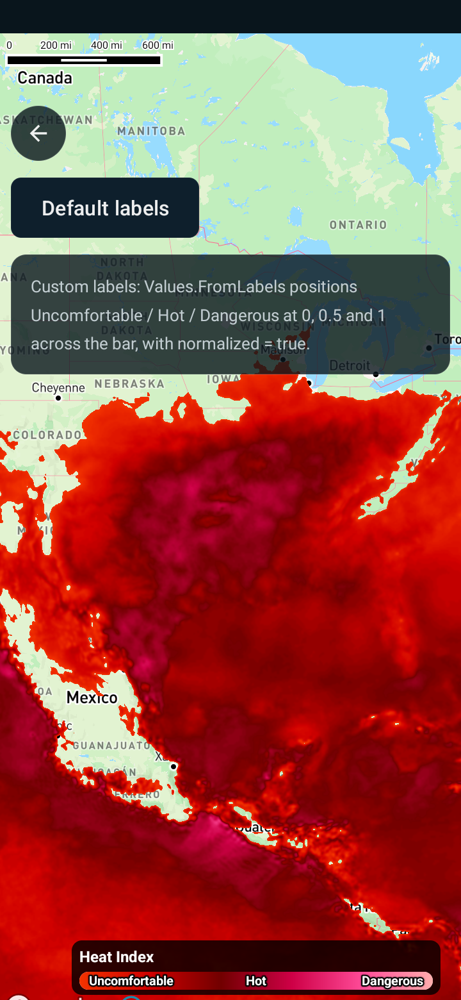

Customizing the heat index legend
=================================

Android port of the MapsGL JS example
[Customizing the heat index legend](https://www.xweather.com/docs/mapsgl/examples/custom-heat-index-legend).

> Published as
> [MapsGL Android → Examples → Customizing the heat index legend](https://www.xweather.com/docs/mapsgl-android-sdk/examples/custom-heat-index-legend).
> That page is the source of truth; this copy is here so the demo repo stands alone.

This example updates the heat index legend after 5 seconds to display custom labels based on a
normalized range of heat index values (from 0 to 1).

Runnable source: [`CustomHeatIndexLegendActivity.kt`](../../app/src/main/java/com/example/mapsgldemo/docExamples/CustomHeatIndexLegendActivity.kt)
(**Documentation Examples → Customizing the heat index legend**).



The screen also carries a toggle so you can flip between the SDK's default labels and the custom
ones rather than reloading to see the difference.

---

## Adding the legend control

The JS example passes a CSS selector and the SDK builds the control into that element:

```js
controller.addLegendControl('#legend');
```

On Android you own the `LegendControl`, hand it to the controller, and place its view yourself.
That is more code, but it means the legend is an ordinary Android view you can constrain wherever
you want:

```kotlin
private val legendControl = LegendControl()

controller.add(legendControl)
legendControl.setDarkTheme(true)

val legendView = legendControl.getView()
legendView.id = View.generateViewId()
binding.customHeatIndexLegendRoot.addView(legendView)
(legendView.layoutParams as ConstraintLayout.LayoutParams).apply {
    endToEnd = ConstraintLayout.LayoutParams.PARENT_ID
    bottomToBottom = ConstraintLayout.LayoutParams.PARENT_ID
    bottomMargin = dp(24)
    marginEnd = dp(16)
    width = dp(300)
}
```

## Getting the legend for a layer

JS reaches it through the controller's control registry:

```js
const legend = controller.controls.legend.getLegend('heat-index');
```

Android's `LegendControl.getLegend(id)` takes the same id string:

```kotlin
val legend = legendControl.getLegend("heat-index")
```

That id is `LegendCode.HEAT_INDEX.id`, the same `"heat-index"` value the JS SDK uses.

A legend is only registered once its layer has been added, so look it up *after*
`addWeatherLayer` — this example does it on a five-second delay, which is late enough either way.

## Replacing the labels

JS applies a partial update describing just the labels:

```js
legend.update({
    bar: {
        labels: {
            normalized: true,
            values: [
                { value: 0,   label: 'Uncomfortable' },
                { value: 0.5, label: 'Hot' },
                { value: 1,   label: 'Dangerous' }
            ],
            marks: 'none'
        }
    }
});
```

Android has no partial-update dictionary. The equivalent is to set `values` on the bar's
`BarLegendLabels` to a `Values.FromLabels` — the variant whose accessor returns `(position, label)`
pairs, the direct counterpart of the JS `values` array — and then hand the legend back to
`LegendControl.update`:

```kotlin
val legend = legendControl.getLegend("heat-index") as? BarLegend<UnitTemperature> ?: return

legend.items.forEach { item ->
    item.labels.values = BarLegendLabels.Values.FromLabels {
        listOf(
            0.0 to "Uncomfortable",
            0.5 to "Hot",
            1.0 to "Dangerous",
        )
    }
    item.labels.normalized = true
}

legendControl.update(legend)
```

`getLegend` returns the `Legend` interface, so the cast to `BarLegend<UnitTemperature>` is what
gives access to `items`. Heat index is a temperature-measurement bar legend; a different product
would use its own unit type.

`items`, `labels`, `values` and `normalized` are all `var`, so mutating in place and calling
`update` is the shortest path. The `copy`-based route exists too, but fights the generics for no
benefit here.

## Two Android specifics

**`FromLabels` positions are always bar fractions.** The renderer takes the first element of each
pair as a `0..1` position across the bar and uses it directly, so this variant pairs with
`normalized = true` and values in that range. Raw data values — 90, 100, 110 — belong in
`Values.FromValues`, which converts them through the colour ramp. Passing degrees to `FromLabels`
puts every label at the same end of the bar.

**`marks: 'none'` has no counterpart, and needs none.** The Android bar legend draws the colour
ramp and the label text and nothing else — there are no tick marks to switch off — so the JS
example's third setting is already the Android default.

## The default it replaces

For reference, the built-in heat-index legend labels every 10°F through `Values.Every`:

| | labels |
| --- | --- |
| default | `90°F` `100` `110` `120` |
| after the update | `Uncomfortable` `Hot` `Dangerous` |

so this example is really a switch from an interval-generated scale to three fixed, qualitative
stops — which is why `normalized` matters: the positions no longer mean degrees.

## Related

- [Change map units](change-map-units.md) — the other legend example in this app, which relabels
  the same kind of bar by changing units instead of labels
