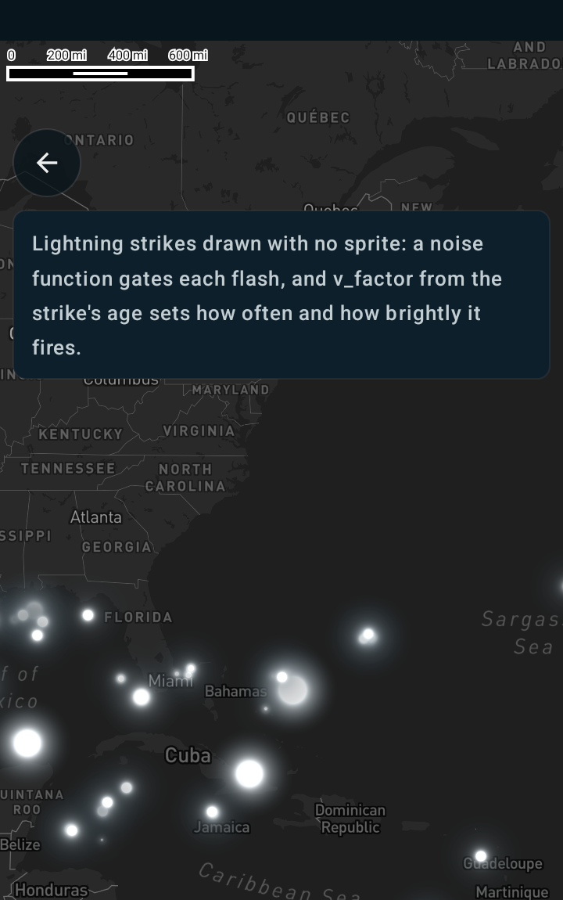

Custom lightning symbols using a shader
=======================================

Android port of the MapsGL JS example
[Custom lightning symbols using a shader](https://www.xweather.com/docs/mapsgl/examples/custom-lightning-shader).

> Published as
> [MapsGL Android → Examples → Custom lightning symbols using a shader](https://www.xweather.com/docs/mapsgl-android-sdk/examples/custom-lightning-shader).
> That page is the source of truth; this copy is here so the demo repo stands alone.

This example customizes the appearance of lightning symbols with a custom fragment shader on
`IconPaint.shader`. Each strike draws procedurally — no sprite — and a noise function gates when it
flashes, animated and varying with the age of the strike.

Runnable source: [`CustomLightningShaderActivity.kt`](../../app/src/main/java/com/example/mapsgldemo/docExamples/CustomLightningShaderActivity.kt)
(**Documentation Examples → Custom lightning symbols using a shader**).



Read [Custom earthquake symbols using a shader](custom-earthquake-shader.md) first — it covers the
icon-less shader path, the `v_tex` / `u_time` interface, the non-premultiplied blend and the `spin`
trick for keeping frames coming. This page covers only what the lightning effect adds.

---

## Age drives everything

The only paint expression is the factor, straight from the JS example:

```kotlin
// JS: factor: ['/', ['-', 200, ['get', 'age']], 200]
paint.icon.factor = StyleValue.Expression(
    Expression.divide(
        Expression.subtract(200.0, Expression.get("age")),
        200.0,
    ),
)
```

A fresh strike is near `1.0`; a 200-second-old one reaches `0.0`. Inside the shader `v_factor`
appears four times — flash duration, flash frequency, flash intensity, and overall alpha — so a
recent strike flashes often and brightly while an old one barely registers. That single expression
is what makes the layer feel alive, and the demo screen has a toggle that pins it high so you can
see what it is doing.

`age` is a real property on these features: the built-in `LightningStrikes` product colours its
circles with `Expression.step(Expression.get("age"), …)`, so the same value is available here.

## Size is a plain constant

The JS `size: { width: 60, height: 60 }` is constant and square, so `iconSize` carries it directly
— no need for the per-axis `iconWidth` / `iconHeight` that the
[fires example](custom-fires-shader.md) requires:

```kotlin
paint.icon.iconSize = IconSize(60f, 60f)
```

## The basemap is not decoration

The JS example loads `dark-v9`. That matters: the flash colour is `vec4(235, 241, 245, 255) / 255`
— very nearly white — so on the default light style there is almost nothing to see.

Loading a style replaces it wholesale, which discards a custom layer added beforehand, so add the
layer inside the load callback:

```kotlin
controller.mapView.mapboxMap.loadStyle(Style.DARK) {
    controller.addWeatherLayer(config)
}
```

## The one setting that does not port: `blending: 2`

The JS paint asks for a non-default blend mode, and its shader premultiplies to suit
(`gl_FragColor.rgb *= gl_FragColor.a`).

Android's symbol pass has no paint-level blend option — `VectorSymbolLayerRenderer` fixes it at
`GL_SRC_ALPHA, GL_ONE_MINUS_SRC_ALPHA` for every symbol layer. This port therefore drops both the
blending request and the premultiply, and composites with straight alpha.

An isolated flash looks the same either way. The difference shows where two flashes overlap:
additive blending accumulates into a brighter core, while straight alpha lets the nearer one win.

Additive blending does exist in the SDK — `VectorHeatmapLayerRenderer` uses `GL_ONE, GL_ONE` — it
simply is not exposed for symbol layers, so closing this gap would be a renderer change rather
than a paint one.

## The JS listing carries a lot of dead code

Worth knowing before comparing the two shaders line by line. The published shader declares

`rand3d`, `noise3d`, `perlin`, `perlin3d`, `vPosition`, `vRandom`, `resolution`, `dpr`, and the
`SIZE`, `RADIUS`, `SPEED` and (empty) `SEED` defines

and uses **none** of them. Only `rand`, `noise` and `FLASH_POWER` do any work. This port keeps what
runs and drops the rest, so the flash maths is unchanged while the shader is about a third of the
length.

## Watch the layer id

`WeatherService.LightningStrikes` pairs this source with a circle layer, and
`WeatherService.LightningStrikesIcons` gives its symbols a sprite — which would turn `v_tex` into
atlas coordinates and break the distance maths. This layer uses its own id and sets no icon image:

```kotlin
override val layer: SymbolLayerDescriptor = SymbolLayerDescriptor(
    id = "severe.lightning.flash",
    source = source.id,
    paint = SymbolLayerPaint(icon = IconPaint(), text = emptyList()),
)
```

## The ported shader

```glsl
#version 300 es
precision highp float;

uniform float u_time;

in vec2  v_tex;
in vec4  v_color;
in float v_factor;

out vec4 fragColor;

float rand(float x) {
    return fract(sin(x) * 75154.32912);
}

float noise(float x) {
    float i = floor(x);
    float a = rand(i), b = rand(i + 1.0);
    float f = x - i;
    return mix(a, b, f);
}

#define COL1 vec4(0, 0, 0, 0) / 255.0
#define COL2 vec4(235, 241, 245, 255) / 255.0
#define FLASH_POWER 0.8

void main() {
    // Radially symmetric about the quad centre, so v_tex needs no Y flip here.
    vec2 pos = v_tex;

    float dist = length(2.0 * pos - 1.0) * 2.0;
    float x = u_time + 0.1;

    float m = 0.2 + 0.2 * v_factor;        // max duration of strike
    float i = floor(x / m);
    float f = x / m - i;
    float k = v_factor;                    // frequency of strikes
    float n = noise(i);
    float t = ceil(n - k);                 // occurrence
    float d = max(0.0, n - k) / (1.0 - k); // duration
    float o = ceil(t - f - (1.0 - d));     // occurrence with duration

    float fx = 4.0;
    if (o == 1.0) {
        fx += 10.0 * v_factor;
    }

    fx = max(4.0, fx);
    float g = fx / (dist * (10.0 + 20.0)) * FLASH_POWER;

    // smooth out edges to avoid fading extending beyond the symbol's bounds
    float edgeFadeFactor = smoothstep(0.5, 1.0, dist);
    float invertedEdgeFadeFactor = 1.0 - edgeFadeFactor;

    vec4 color = mix(COL1, COL2, g);
    color.a *= min(1.0, 0.5 + v_factor) * invertedEdgeFadeFactor;

    // v_color.a carries the collision fade. No premultiply: this renderer blends
    // GL_SRC_ALPHA, GL_ONE_MINUS_SRC_ALPHA.
    fragColor = vec4(color.rgb, clamp(color.a, 0.0, 1.0) * v_color.a);
    if (fragColor.a < 0.01) discard;
}
```

## Related

- [Custom earthquake symbols using a shader](custom-earthquake-shader.md) — the shader interface and
  the icon-less path, in full
- [Custom fire symbols using a shader](custom-fires-shader.md) — `#include <fbm>`, `v_random`, and
  per-axis sizing
