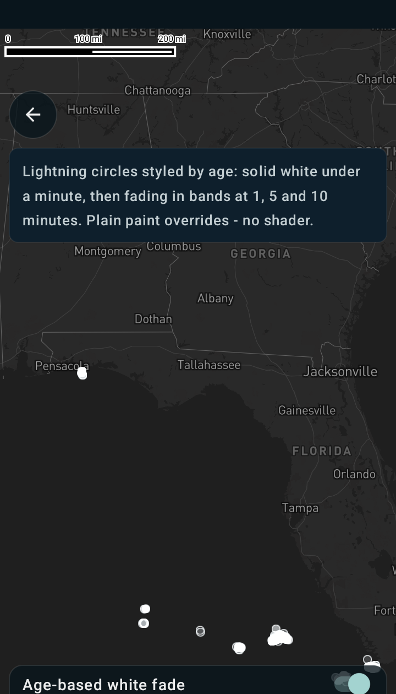

Customizing lightning point styles
==================================

Android port of the MapsGL JS example
[Customizing lightning point styles](https://www.xweather.com/docs/mapsgl/examples/custom-lightning-styles).

> Published as
> [MapsGL Android → Examples → Customizing lightning point styles](https://www.xweather.com/docs/mapsgl-android-sdk/examples/custom-lightning-styles).
> That page is the source of truth; this copy is here so the demo repo stands alone.

This example customizes the circle styles of the `lightning-strikes` weather layer by adjusting the
circle fill colour and opacity based on the age of each strike. No shader — this is the plain
paint-override pattern, so it is the gentlest of the customization examples.

Runnable source: [`CustomLightningStylesActivity.kt`](../../app/src/main/java/com/example/mapsgldemo/docExamples/CustomLightningStylesActivity.kt)
(**Documentation Examples → Customizing lightning point styles**).



---

## Overriding paint on a built-in configuration

`WeatherService.LightningStrikes` returns the same configuration `addWeatherLayer` would build from
`LayerCode.LIGHTNING_STRIKES`. Mutate its paint before adding it and the layer arrives styled —
the Android counterpart of the JS options argument:

```kotlin
val lightning = WeatherService.LightningStrikes(controller.service)
val paint = lightning.layer.paint          // CircleLayerPaint

// …style it…

controller.addWeatherLayer(lightning)
```

Unlike the alerts example, `CircleLayerPaint.fill`, `.stroke` and `.circle` are non-null, so there
is no `?.` dance:

```kotlin
paint.stroke.color = StyleValue.Constant(Color.White)   // JS stroke.color '#fff'
paint.stroke.thickness = StyleValue.Constant(1.0)       // JS stroke.thickness 1
paint.circle.radius = StyleValue.Constant(4.0)          // JS circle.radius 4
```

`Color` here is `androidx.compose.ui.graphics.Color`. The SDK's own `toColor` string helper is
`internal`, so from app code either use a `Color` constant, or put a colour **string** inside an
expression, which is what the fill does below.

## The one real difference: `fill.opacity` is not data-driven

The JS example drives **two** properties from the same `age` value:

```js
fill: {
    color: ['step', ['coalesce', ['get', 'age'], 0], '#ffffff',
            61, 'rgba(255, 255, 255, 0.7)',
            301, 'rgba(255, 255, 255, 0.5)',
            601, 'rgba(255, 255, 255, 0.3)'],
    opacity: ['step', ['coalesce', ['get', 'age'], 0], 1, 61, 0.8, 301, 0.6, 601, 0.4]
}
```

On Android only the colour is data-driven. `VectorCircleLayerRenderer` reads
`paint.fill.opacity.constantValue` in every one of its code paths, so an expression assigned to
`FillPaint.opacity` resolves to `null`, falls back to `1.0`, and is **silently ignored** — no error,
no log, the fade just doesn't happen. Per-feature colour *alpha* does work: the renderer evaluates
the colour expression and packs the resulting alpha straight into the vertex data.

So fold the two ladders into one. Multiplying the JS pairs gives the alpha that example actually
renders, and those are the numbers to use:

| age (s) | JS colour alpha | JS opacity | rendered | this port |
| --- | --- | --- | --- | --- |
| 0–60 | 1.0 | 1.0 | **1.00** | 1.00 |
| 61–300 | 0.7 | 0.8 | **0.56** | 0.56 |
| 301–600 | 0.5 | 0.6 | **0.30** | 0.30 |
| 601+ | 0.3 | 0.4 | **0.12** | 0.12 |

```kotlin
paint.fill.color = StyleValue.Expression(
    Expression.step(
        Expression.coalesce(listOf(Expression.get("age"), 0.0)),
        listOf(
            Expression.Step(null, "rgba(255, 255, 255, 1)"),
            Expression.Step(61.0, "rgba(255, 255, 255, 0.56)"),
            Expression.Step(301.0, "rgba(255, 255, 255, 0.30)"),
            Expression.Step(601.0, "rgba(255, 255, 255, 0.12)"),
        ),
    ),
)
```

Measured on a device at zoom 5, circle peak brightness fell into two clusters — 255 and about 158.
Against the dark basemap (roughly 35 grey) an alpha of 0.56 predicts `0.56·255 + 0.44·35 ≈ 158`, so
the folded ladder reproduces the JS appearance rather than approximating it.

## `step` wants the base output first

`Expression.step` takes `Expression.Step` objects, and the **first** one is the output used below
the first real threshold — its `value` is ignored, so pass `null`:

```kotlin
Expression.Step(null, "rgba(255, 255, 255, 1)")   // base case
Expression.Step(61.0, "…")                        // first real threshold
```

That mirrors the JS form, where the output immediately after the input is the base case.
`coalesce` guards strikes that arrive without an `age`, so they land on the base output by intent
rather than by accident.

## The basemap

The JS example loads `dark-v9`. White circles on the default light style would be invisible, so
this screen loads `Style.DARK` and adds the layer in the load callback — replacing a style discards
a layer added before it:

```kotlin
controller.mapView.mapboxMap.loadStyle(Style.DARK) { addStrikes() }
```

## Related

- [Custom lightning symbols using a shader](custom-lightning-shader.md) — the same layer and the
  same `age` property, but drawn procedurally by a fragment shader instead of as circles
- [Customizing alert polygon styles](https://www.xweather.com/docs/mapsgl-android-sdk/examples/custom-alert-styles)
  — the same paint-override pattern on a fill layer
