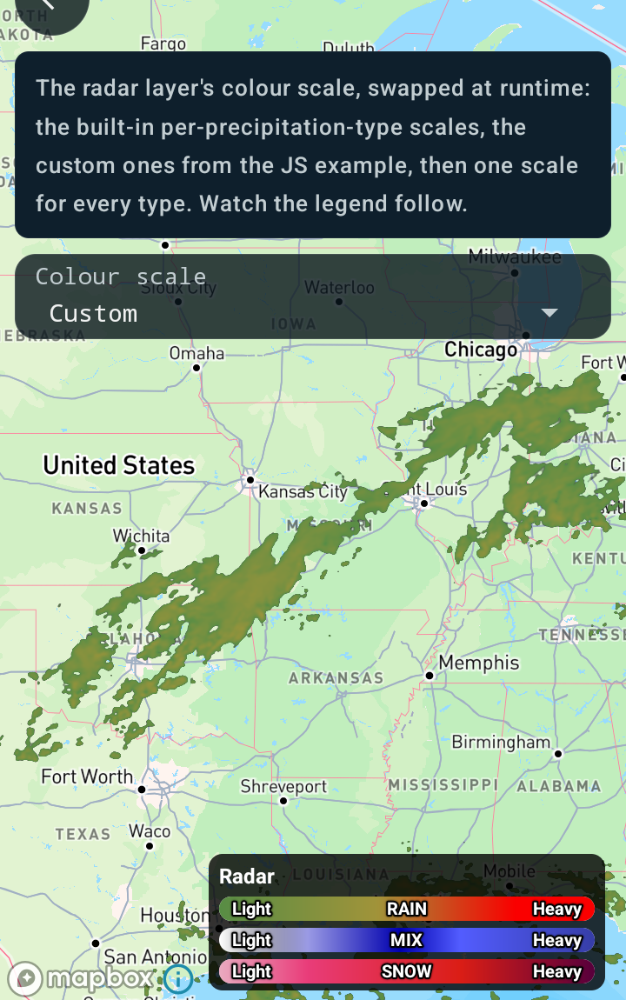
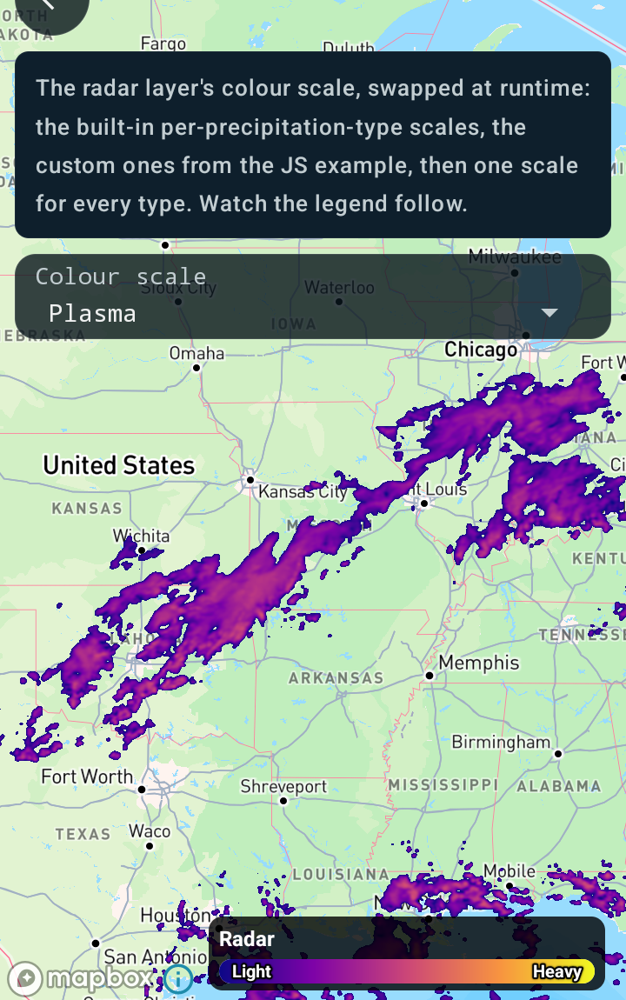

Customizing radar color scale
=============================

Android port of the MapsGL JS example
[Customizing radar color scale](https://www.xweather.com/docs/mapsgl/examples/custom-radar-colorscale).

> Published as
> [MapsGL Android → Examples → Customizing radar color scale](https://www.xweather.com/docs/mapsgl-android-sdk/examples/custom-radar-colorscale).
> That page is the source of truth; this copy is here so the demo repo stands alone.

This example swaps the radar layer's colour scale while the map is running — between the built-in
per-precipitation-type scales, a custom set, and three generic palettes — with the legend on screen
so you can watch it follow.

Runnable source: [`CustomRadarColorscaleActivity.kt`](../../app/src/main/java/com/example/mapsgldemo/docExamples/CustomRadarColorscaleActivity.kt)
(**Documentation Examples → Customizing radar color scale**).



The same radar, same moment, under a plasma palette. One scale now covers every precipitation
type, so the legend has folded its three bars into one:



---

## Assigning the scale is not enough on its own

This is the part worth reading before you write any of it.

The JS example calls `setPaintProperty` and the map repaints:

```js
radarLayer.setPaintProperty('sample.colorscale', { stops: … });
```

Android has the same assignment, and it even carries the same property name:

```kotlin
paint.sample.colorScale = ColorScaleOptions(stops = …)
```

`SamplePaint.colorScale` has a setter that emits `PAINT_CHANGE` with property `"sample.colorscale"`.
But the controller's handler for that event only calls `syncLegend`. **The legend re-draws in the new
colours and the map keeps the old ones** — no error, no log.

The reason is where the colours live. A sample layer's scale is baked into GL lookup-table textures
by `EncodedDataRenderer.setup`, and that runs from `createProgram` / `resetProgram` — once per
program, not per frame. Nothing short of rebuilding the program picks up a new scale, and no public
entry point does that in place.

So assign the scale, then re-add the layer:

```kotlin
private fun reloadRadar() {
    controller.removeWeatherLayer(LayerCode.RADAR)
    controller.addWeatherLayer(radar)   // same config object, new program, new LUTs
}
```

Keep the configuration object in a field so the same instance — with its mutated paint — is the one
that goes back on:

```kotlin
private lateinit var radar: WeatherConfiguration
private lateinit var paint: SamplePaint

override fun customizeLayers(controller: MapboxMapController) {
    val config = WeatherService.Radar(controller.service)
    radar = config
    paint = (config.layer.paint as SampleLayerPaint).sample
    applyScale()
    controller.addWeatherLayer(config)
}
```

Re-adding costs a brief flicker while tiles come back. That is the honest cost of the feature today.
Compare `MapboxMapController.refreshGlVectorLayerPaint`, which does exist for vector layers — the
equivalent for sample layers is the gap.

## Per-precipitation-type scales: nested stop lists

The JS example passes three masks and relies on array order:

```js
masks: [ { colorscale: rain }, { colorscale: mix }, { colorscale: snow } ]
```

Android has two ways to say this. The built-in radar configuration nests one stop list per type
inside `stops`, and that is the idiom to follow:

```kotlin
ColorScaleOptions(
    stops = listOf(
        ColorScales.radarRain.stops,
        ColorScales.radarMix.stops,
        ColorScales.radarSnow.stops,
    ),
)
```

`ColorScaleOptions.stops` is a `List<Any>`, and the SDK's `colorStopsFromOptionsStops` accepts both a
flat list of `ColorStop` and a nested list of bands, which is what makes both forms legal.

There is also an explicit `masks` form, whose entries carry the raster band and the discrete
precipitation-type code rather than depending on position. Worth knowing about — the JS example's own
comments label its three masks rain / snow / mix while the array is read rain / mix / snow.

`normalized` stays `false` for these, because the stop values are real dBZ numbers.

## Colour strings are hex only

`ColorStop` has a secondary constructor taking a string, which is what keeps these ladders readable
from app code — the SDK's `toColor` helper is `internal`, so a `Color` object is otherwise the only
way in.

That constructor is hex **only**. It hands the string to `android.graphics.Color.parseColor`, which
understands `#RRGGBB`, `#AARRGGBB` and the named colours, and throws `NumberFormatException` on
anything else. The JS example's `'rgba(0,0,0,0)'` is therefore `"#00000000"` here — alpha leads in
the Android form, and getting this wrong crashes in the companion-object initializer before the
activity ever draws.

```kotlin
private val CLEAR = listOf(
    ColorStop(0.0, "#00000000"),
    ColorStop(5.9, "#00000000"),
)

val CUSTOM_RAIN = CLEAR + listOf(
    ColorStop(6.0, "#588d45"),
    ColorStop(40.0, "#a1943a"),
    ColorStop(70.0, "#fa0000"),
)
```

That transparent lead-in is not decoration: without it the lowest colour in the scale floods the map
everywhere there is no precipitation. The JS example does the same thing by passing
`['rgba(0,0,0,0)']` as the prefix argument to `getColorScale`.

## No generic palettes to look up

JS reaches for `styles.getColorScaleNames()` and `styles.getColorScale(name, prefix)` to pull
ready-made normalized palettes — rainbow, viridis, plasma and so on.

This SDK ships the weather scales (`ColorScales`) but **no** generic palettes and no lookup by name.
The three offered here are defined in the activity: the standard viridis and plasma control points
and a plain hue sweep.

They are written as 0..1 control points — the shape JS hands back, and the form those palettes are
published in — and then mapped onto real dBZ stops:

```kotlin
// The numbers LegendCode.RADAR's own bars use, so the palette covers exactly what the legend draws.
private const val DBZ_MIN = 6.0
private const val DBZ_MAX = 87.0

private fun paletteOverDbz(palette: List<Pair<Double, String>>): List<ColorStop> =
    CLEAR + palette.map { (position, hex) ->
        ColorStop(DBZ_MIN + position * (DBZ_MAX - DBZ_MIN), hex)
    }
```

### Why not just set `normalized = true`?

Because it draws on the map and leaves the legend blank, which is worth understanding before you
reach for it.

`ColorScaleOptions.normalized` takes the 0..1 positions directly, and the raster renderer handles
that fine. The bar legend does not. `syncLegend` intersects the paint's range with each legend
item's own template range:

```kotlin
val mergedRange = intersectClosedRanges(paintAlignedScale.range, item.colorScaleOptions.range)
    ?: paintAlignedScale.range
    ?: item.colorScaleOptions.range
```

A normalized scale carries no range of its own, so the intersection falls through to the radar
legend template's own span, which is `6.0..87.0`. The bar then samples a scale whose last stop is at
`1.0` across 6–87, and comes out empty — no error, no log, just blank ramps next to a map that looks
right.

Real dBZ stops keep the two in agreement. They also hand the palette its whole span: normalizing
over radar's full draw range crowds every real echo into the bottom fifth of the palette, so a
normalized plasma rendered almost entirely in its purples.

## The picker is a drop-down

The JS example uses a `<select>`, and the Android counterpart is a `Spinner`. The demo scaffold
gained an `addChoice(label, options, initialIndex) { index -> }` helper for it, alongside the
existing `addSlider` and `addToggle`.

A slider was the wrong control here and it is worth saying why, because the failure is quiet.
`addSlider` maps its track onto 100 steps, so choosing one of five named options means landing in
the right 1/100th of the track and flooring to an index. A drag that stops slightly short reads back
as the neighbouring option — on this screen that showed up as a label reading `Default` with the
thumb sitting at position two. A drop-down names every choice and cannot be off by one.

Two details in the helper worth copying:

- `onChange` fires only when the selection actually changed. That matters when the handler re-adds a
  layer.
- The rows are inflated from `android.R.layout.simple_spinner_item`, which assumes a light
  background, so `getView` / `getDropDownView` retint them. The popup gets an **opaque** background
  too — the shared translucent panel drawable lets map detail through behind the labels, which is
  precisely what makes a picker hard to read.

## Showing the legend

The customization scaffold these demos share had no legend at all. It now takes an opt-in:

```kotlin
override val showLegend = true
```

The scaffold registers a `LegendControl` **before** `customizeLayers` runs — a legend is created as
its layer is added, so a control registered afterwards has nothing to pick up.

It also swaps the legend with the controls panel: the legend takes the bottom, above the timeline,
and the controls move up under the caption. That is the right way round for a screen whose control
changes what the legend describes — the legend reads as part of the map, and the thing you touch
sits near the thing that tells you what you did. The swap is scoped to legend-showing demos, so
every other customization demo keeps its controls at the bottom.

One detail if you copy it: `bottomToTop` has to be cleared explicitly with
`ConstraintLayout.LayoutParams.UNSET`. Leave it in place and the panel keeps its XML anchor to the
timeline while gaining the new top anchor, and stretches the whole height of the map.

The legend earns its place here for more than decoration. It is the thing that disagrees with the
map when a scale change only half-applies: with the re-add disabled, the legend switches to plasma
while the map keeps drawing the default greens. That is the failure at the top of this page, visible
in one screenshot.

### Folding three bars into one

The JS demo combines the per-type legends when they are all the same scale, and the Android port
should do the same.

`LegendCode.RADAR`'s template is three bars by construction — rain, mix, snow — each labelled with
its type word. Hand it one scale for everything and `syncLegend` writes that scale into all three,
so you get three identical ramps labelled RAIN / MIX / SNOW: three findings where there is only one.

So drop to a single bar, and drop the type word from its labels. The legend's own `Radar` title
already says what it describes:

```kotlin
@Suppress("UNCHECKED_CAST")
private fun combineLegendBarsIfOneScale() {
    if (SCALE_NAMES[scaleIndex] in PER_TYPE_SCALES) return
    val legend = legendControl.getLegend(LEGEND_ID) as? BarLegend<Dimension> ?: return
    val bar = legend.items.firstOrNull() ?: return
    val combined = bar.copy(
        labels = bar.labels.copy(
            values = BarLegendLabels.Values.FromLabels<Dimension> {
                listOf(0.0 to "Light", 1.0 to "Heavy")
            },
        ),
    )
    legendControl.update(legend.copy(items = listOf(combined)))
}
```

Two things make this simpler than it looks:

- **It needs no inverse.** `removeWeatherLayer` drops the legend, and the next `addWeatherLayer`
  registers the configuration's own three-bar template again. `legend.copy(...)` never touches
  `config.legend`, so switching back to a per-type scale restores all three bars on its own —
  verified round-tripping Default → Plasma → Default on a device.
- **Call it after the layer is added**, since that is when the legend exists. `applyScale` fires
  `PAINT_CHANGE` against the *old* legend, then the re-add builds a fresh one; the fold goes last.

`LEGEND_ID` is `LegendCode.RADAR.id`, and `Dimension` is
`com.xweather.mapsgl.extensions.Dimension` — the radar legend's bars are declared over
`MeasurementUnits.IMPERIAL.none`, so there is no unit-specific type to name here the way the heat
index example names `UnitTemperature`.

## Related

- [Customizing temperature colors](custom-temps-fill.md) — the same sample-layer colour scale API
  set once at add time, plus `interval` banding
- [Customizing the heat index legend](custom-heat-index-legend.md) — the other half of the colour
  story: changing what the legend says about a scale rather than the scale itself
- [Customizing alert polygon styles](https://www.xweather.com/docs/mapsgl-android-sdk/examples/custom-alert-styles)
  — paint overrides on a vector layer, where an in-place refresh does exist
