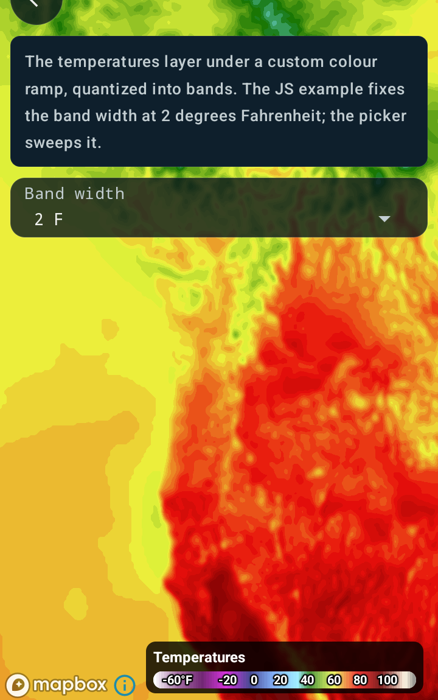
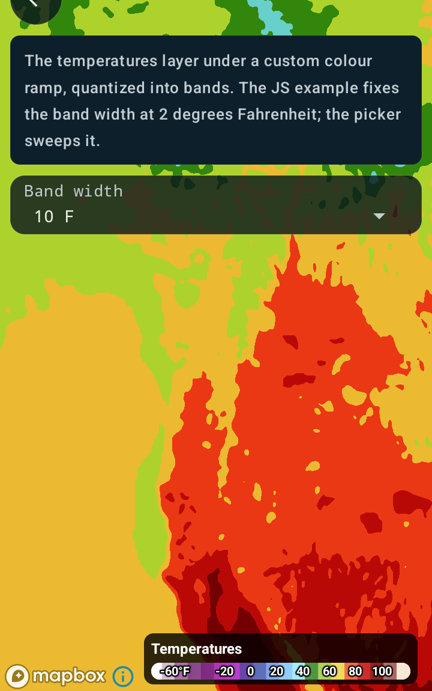

Customizing temperature colors
==============================

Android port of the MapsGL JS example
[Customizing temperature colors](https://www.xweather.com/docs/mapsgl/examples/custom-temps-fill).

> Published as
> [MapsGL Android → Examples → Customizing temperature colors](https://www.xweather.com/docs/mapsgl-android-sdk/examples/custom-temps-fill).
> That page is the source of truth; this copy is here so the demo repo stands alone.

This example configures the `temperatures` weather layer with a custom colour scale and a colour
stop interval, so the fill draws as discrete bands rather than a smooth gradient.

Runnable source: [`CustomTempsFillActivity.kt`](../../app/src/main/java/com/example/mapsgldemo/docExamples/CustomTempsFillActivity.kt)
(**Documentation Examples → Customizing temperature colors**).



The band width is a knob on this screen. At 10 degrees Fahrenheit the quantizing is obvious:



---

## `interval` alone does nothing: it needs `interpolate = false`

This is the one place the port cannot copy the JS paint verbatim, and the failure is silent.

In JS, a non-zero `interval` is enough:

```js
colorscale: {
    stops: [ /* … */ ],
    interval: aerisweather.mapsgl.units.FtoCUnit(2)
}
```

On Android the renderer hands both settings to `ColorLookupTable`, which quantizes the stops onto
the interval grid only when **both** conditions hold:

```kotlin
// ColorLookupTable.createColorLookupBitmap
if (!interpolate && interval > 0.0) { /* … expand stops onto the interval grid … */ }
```

Leave `interpolate` at its default `true` and the interval is ignored — no error, no log line, just
a smooth gradient. I hit this on the way in: a frame rendered at `interval = FtoCUnit(10.0)` came
back **pixel-identical** to one at `interval = 0.0`, and the only region that differed between the
two screenshots was the picker's own label.

The two screenshots above are the same view at the same data interval, with only the band width
changed. Expect the hues to shift as well as the edges: quantizing snaps a sampled value onto the
interval grid *before* the colour lookup, so a coarse interval can land a pixel on a different part
of the ramp than its true value would. The broad green in the second image is the left-hand region
snapping down toward the ramp's 5 C stop, where the 2-degree bands keep it near the 15 C stop's
yellow. That is the quantizing working, not a ramp error - but it is why a wide interval is a
styling decision rather than a free cosmetic tweak.

So the Android form of that paint is:

```kotlin
paint.sample.colorScale = ColorScaleOptions(
    stops = CUSTOM_RAMP,
    interval = FtoCUnit(2.0),
    interpolate = false,      // not in the JS example, and required here
)
```

The two flags are not redundant. `interval` sets the width of a band; `interpolate` decides whether
the lookup table is smoothed at all. A smooth gradient is `interval = 0.0` with `interpolate = true`,
which is what the built-in temperatures configuration ships.

## The interval is a width, not a temperature

Stop values are Celsius, because that is what the temperatures source publishes. So is the
interval — and converting a *width* is not the same as converting a *reading*:

```kotlin
import com.xweather.mapsgl.utils.FtoCUnit

interval = FtoCUnit(2.0)   // 1.11 C  — correct
interval = FtoC(2.0)       // -16.7   — wrong: subtracts the 32-degree offset
```

`FtoC` converts a temperature and applies the offset. A width is a difference, so only the scale
factor applies, which is what the `Unit` variants are for. The SDK ships both in
`com.xweather.mapsgl.utils`, and `FtoCUnit` is the same helper under the same name as the JS
example's `aerisweather.mapsgl.units.FtoCUnit(2)`.

One cosmetic difference: Android's `FtoCUnit` multiplies by `0.555` rather than `5/9`, so a 2-degree
band is 1.110 C here against 1.1111 in JS. That is a 0.1% difference in band width and invisible on
screen, but it is there if you compare stop boundaries between the two SDKs.

## The ramp

Straight from the JS example, in degrees Celsius:

```kotlin
val CUSTOM_RAMP = listOf(
    ColorStop(-60.0, "#FFFFFF"),
    ColorStop(-50.0, "#9C619B"),
    ColorStop(-40.0, "#58005b"),
    ColorStop(-30.0, "#ce00d7"),
    ColorStop(-20.0, "#121475"),
    ColorStop(-10.0, "#5b97f8"),
    ColorStop(0.0, "#81e8ff"),
    ColorStop(5.0, "#0f7001"),
    ColorStop(15.0, "#ecf93d"),
    ColorStop(25.0, "#e90f0b"),
    ColorStop(35.0, "#6b0001"),
    ColorStop(45.0, "#fff7e2"),
    ColorStop(50.0, "#7b7b7b"),
)
```

`ColorStop`'s string constructor is hex only — see the
[radar colour scale example](custom-radar-colorscale.md) for what happens if you hand it an
`rgba()` string.

## Styling before the layer goes on

The JS example passes `paint` to `addWeatherLayer`. The Android equivalent is to mutate the
configuration before adding it, which needs no refresh machinery at all:

```kotlin
val config = WeatherService.Temperatures(controller.service)
val paint = (config.layer.paint as SampleLayerPaint).sample
paint.colorScale = ColorScaleOptions(/* … */)
controller.addWeatherLayer(config)
```

Changing it *after* the layer is on the map is the harder case, and it is the same constraint as the
[radar colour scale example](custom-radar-colorscale.md): a sample layer's scale is baked into GL
lookup-table textures when its program is created, so the layer has to be removed and re-added for
a new scale to reach the renderer.

## Two assignments, because the legend and the map take different routes

Worth knowing if you put a control on this.

Adding a layer registers the **configuration's** legend template, whose own interval is `0`. So the
bar comes back smooth however the fill is drawn, and the legend disagrees with the map. Assigning
`colorScale` emits `PAINT_CHANGE`, and the controller's handler for that pushes the paint's scale
into the legend.

That splits cleanly into two assignments around the add:

```kotlin
applyScale()                        // styles the fill: the renderer reads paint as it builds LUTs
controller.addWeatherLayer(config)
applyScale()                        // styles the legend: PAINT_CHANGE reaches the legend control
```

The second one costs nothing on the map — the renderer has already baked its tables, which is the
very limitation above — so it is free to use it for the legend.

## Related

- [Customizing radar color scale](custom-radar-colorscale.md) — the same sample-layer colour scale
  API, swapped at runtime, plus the per-precipitation-type form
- [Customizing wind particles](custom-wind-particles.md) — the same `SamplePaint`, with normalized
  stops instead of real data values, plus the particle settings
- [Customizing the heat index legend](custom-heat-index-legend.md) — changing what a bar legend says
  about a scale rather than the scale itself
