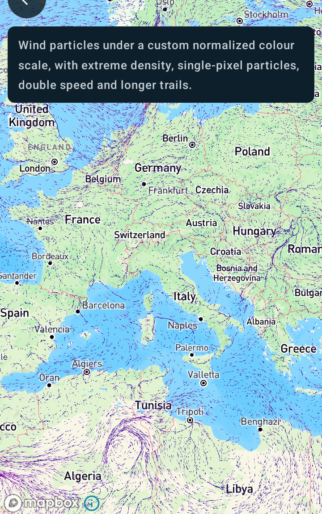

Customizing wind particles
==========================

Android port of the MapsGL JS example
[Customizing wind particles](https://www.xweather.com/docs/mapsgl/examples/custom-wind-particles).

> Published as
> [MapsGL Android → Examples → Customizing wind particles](https://www.xweather.com/docs/mapsgl-android-sdk/examples/custom-wind-particles).
> That page is the source of truth; this copy is here so the demo repo stands alone.

This example configures the `wind-particles` weather layer with a custom normalized colour scale
and different particle generation settings. Like the JS example, it sets the paint once, before the
layer is added.

Runnable source: [`CustomWindParticlesActivity.kt`](../../app/src/main/java/com/example/mapsgldemo/docExamples/CustomWindParticlesActivity.kt)
(**Documentation Examples → Customizing wind particles**).



---

## The paint maps across almost verbatim

This is one of the closest ports in the set — the JS paint object and the Kotlin one line up field
for field:

| JS | Kotlin |
| --- | --- |
| `density: ParticleDensity.extreme` | `density = ParticleDensity.EXTREME` |
| `size: 1` | `size = Size(1)` |
| `speed: 2` | `speed = 2.0` |
| `trailsFade: 0.9` | `trailsFade = 0.9` |

`Size` takes one integer and squares it, exactly as the JS comment describes, so `Size(1)` is the
whole of `size: 1`. The two-argument form is there for wave and swell particles, which are drawn as
rectangles.

```kotlin
paint.particle.density = ParticleDensity.EXTREME
paint.particle.size = Size(1)
paint.particle.speed = 2.0
paint.particle.trailsFade = 0.9
```

## JS merges the paint you pass; here you are mutating a built configuration

`addWeatherLayer('wind-particles', { paint })` in JS deep-merges that object over the built-in
configuration, so naming `colorscale.stops` leaves every sibling field alone.

JS goes further than a plain merge. If the resulting scale has no `range`, it backfills one from
the source dataset's own `dataMin` / `dataMax`, so a scale you build from stops alone still ends up
with a span. (Supplying `stops` also deletes the built-in `masks`, which is how the per-type radar
scales get replaced by a single one.)

Android does neither. `WeatherService.WindParticles` hands back a fully-built configuration and you
edit it, so assigning a **new** `ColorScaleOptions` replaces the object outright — taking with it
whatever the built-in had set, here `range = 0.0..53.64`. `copy()` is the assignment that means what
the JS paint means:

```kotlin
paint.sample.colorScale = paint.sample.colorScale.copy(
    stops = NORMALIZED_STOPS,
    normalized = true,
)
```

The same reasoning applies to `paint.particle`, which is why the four settings above are assigned
field by field rather than as a fresh `ParticlePaint`. That leaves `kind`, `count`, `trails` and the
drop rates at their built-in values — exactly what the JS merge does.

In fairness to the fresh-object form: it renders the same either way. When `colorscale.range` is
null the renderer falls back to the span of the stops themselves, and that turns out to be
sufficient — a normalized scale built with no range at all was pixel-identical to one that kept the
built-in `0.0..53.64`. So `copy()` here is about saying what you mean, not about avoiding a
rendering bug: it keeps `range`, `interval` and `interpolate` when the only thing you set out to
change was the stops.

## Changing the paint after the layer is added

Not something this example does. If you do need to restyle a live layer,
`MapController.setPaintProperty` takes the same key paths as the JS `setPaintProperty` and handles
what each one needs — rebuilding the colour lookup tables, resizing the particle pool, or neither:

```kotlin
controller.setPaintProperty(layerId, "sample.colorscale", scale)
controller.setPaintProperty(layerId, "particle.density", ParticleDensity.LOW)
controller.setPaintProperty(layerId, "particle.size", 4)
```

## Related

- [Customizing temperature colors](custom-temps-fill.md) — the other half of `SamplePaint`, where
  the stops are real data values rather than normalized fractions
- [Customizing radar color scale](custom-radar-colorscale.md) — swapping a sample-layer scale at
  runtime, and the per-precipitation-type form
