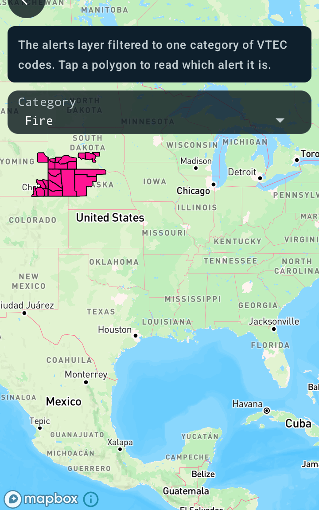

Filter weather alerts by category
=================================

Android port of the MapsGL JS example
[Filter weather alerts by category](https://www.xweather.com/docs/mapsgl/examples/filter-alerts).

> Published as
> [MapsGL Android → Examples → Filter weather alerts by category](https://www.xweather.com/docs/mapsgl-android-sdk/examples/filter-alerts).
> That page is the source of truth; this copy is here so the demo repo stands alone.

This example filters the data shown by the `alerts` weather layer by alert category. A category is a
set of VTEC codes, and the filter keeps only the features whose `VTEC` property is in that set. The
codes are listed under [Alert types](https://www.xweather.com/docs/maps/reference/alert-types).

A drop-down switches category at runtime, and the screen turns on the data inspector, so tapping a
polygon names the alert it kept.

Runnable source: [`FilterAlertsActivity.kt`](../../app/src/main/java/com/example/mapsgldemo/docExamples/FilterAlertsActivity.kt)
(**Documentation Examples → Filter weather alerts by category**).



---

## `contains` is the Android form of `["in", …]`

The JS filter is a membership test:

```js
['in', ['get', 'VTEC'], ['literal', ['SV.W', 'TO.W', …]]]
```

`Expression.contains` is the counterpart, and it serializes to `match` rather than `in`:

```kotlin
Expression.contains(Expression.get("VTEC"), listOf("SV.W", "TO.W", /* … */))
// ["match", ["get", "VTEC"], "SV.W", true, "TO.W", true, …, false]
```

The two are equivalent as a boolean layer filter. `match` is the more widely supported of the pair in
the Mapbox GL native engine, which is why the SDK builds that form — and the SDK's own filter
evaluator handles both. `Expression.literal` exists too, so the `in` shape can be written by hand,
but there is no reason to.

## "All" is no filter at all

JS returns `[]` for the unfiltered case, which reads as an empty expression. The Android equivalent
is `null` — `FillLayerDescriptor.filter` is nullable, and clearing it removes the restriction:

```kotlin
layer.filter = category.codes?.let { Expression.contains(Expression.get("VTEC"), it) }
```

## The data inspector confirms the filter

The screen turns on the SDK's data inspector, which is a one-line opt-in on the demo scaffold and a
single call underneath:

```kotlin
controller.addDataInspectorControl(mapView)
```

Tapping a polygon names the alert, which is how you check the filter did what you meant — every
feature left on the map should belong to the chosen category. In the screenshot above the remaining
polygons report **Red Flag Warning**, which is a `Fire` code, and the severe and coastal groups that
are there unfiltered are gone.

## Changing the filter on a live layer

`MapController.setLayerFilter` is the counterpart of the JS example's `alertsLayer.setFilter(…)`,
and the category picker calls it:

```kotlin
controller.setLayerFilter(layerId, filterFor(category))
```

Setting the filter on the descriptor before `addWeatherLayer` still works and is what the example
does for its opening category. What does **not** work is assigning it afterwards by hand: the
descriptor's filter is copied onto the layer when the layer is added, so a later write to the
descriptor goes nowhere, and writing the layer's own `filter` leaves the meshes built under the old
filter sitting in the source's cache. `setLayerFilter` is the call that handles both.

Earlier SDK versions read a fill layer's filter only to pick a tile parse path and to hit-test taps,
never to decide which features to draw — a filtered alerts layer drew the whole country while the
data inspector, which did apply the filter, disagreed with what was on screen.

## Related

- [Customizing alert polygon styles](https://www.xweather.com/docs/mapsgl-android-sdk/examples/custom-alert-styles)
  — the same layer, styled by severity rather than filtered, and the other place `VTEC` is read
