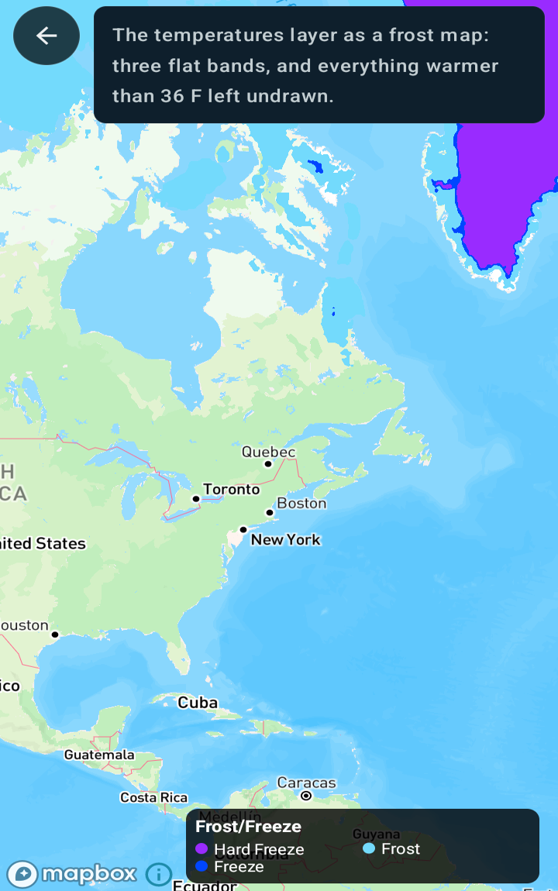

Create a freeze layer
=====================

Android port of the MapsGL JS example
[Create a freeze layer](https://www.xweather.com/docs/mapsgl/examples/frost-freeze-layer).

> Published as
> [MapsGL Android → Examples → Create a freeze layer](https://www.xweather.com/docs/mapsgl-android-sdk/examples/frost-freeze-layer).
> That page is the source of truth; this copy is here so the demo repo stands alone.

Nothing in this example is a dedicated product. It is the ordinary `temperatures` layer with a
three-colour stepped scale and everything above freezing-ish clipped away — which is how an
agricultural frost map is usually made.

Runnable source: [`FrostFreezeLayerActivity.kt`](../../app/src/main/java/com/example/mapsgldemo/docExamples/FrostFreezeLayerActivity.kt)
(**Documentation Examples → Create a freeze layer**).



---

## Three bands, and nothing above them

| Band | Range | Colour |
| --- | --- | --- |
| Hard freeze | at or below 28 °F (−2.22 °C) | `#992BFF` |
| Freeze | above 28 °F, at or below 32 °F (0 °C) | `#0046FF` |
| Frost | above 32 °F, at or below 36 °F (2.22 °C) | `#73DAFC` |

`interpolate = false` is what turns the ramp into bands. Left on, the scale fades one colour into
the next and there is no line at 32 °F to look at:

```kotlin
paint.sample.colorScale = paint.sample.colorScale.copy(
    stops = FROST_FREEZE_STOPS,
    interval = 1.0,
    interpolate = false,
)
```

`copy()` rather than a fresh `ColorScaleOptions`, so the built-in scale's other fields survive —
only the stops, the interval and the interpolation are being replaced.

## `drawRange` is what makes it a frost map rather than a temperature map

```kotlin
paint.sample.drawRange = BoundedRange.atMost(FROST_MAX_C)
```

Everything warmer than 36 °F is simply not drawn. Without it the layer still covers the map in its
coldest colour wherever it has data, and the point of the map — *where frost is possible tonight* —
is lost in it.

`BoundedRange.atMost` is the direct equivalent of the JS example's `drawRange: { max: 2.22 }`: the
bottom is left open, and the renderer fills it in from the layer's own data range. A plain
`ClosedRange` works as well — `drawRange = -90.0..2.22` — but only by naming a floor this map has no
opinion about.

## The legend is a point legend, not a bar

Three named categories are not a continuous ramp, so the legend is three labelled swatches rather
than the bar the temperatures layer normally carries:

```kotlin
config.legend = PointLegend(
    id = "temps-freeze",
    title = "Frost/Freeze",
    items = listOf(
        PointLegendItem(Color.parseColor("#992BFF"), "Hard Freeze"),
        PointLegendItem(Color.parseColor("#0046FF"), "Freeze"),
        PointLegendItem(Color.parseColor("#73DAFC"), "Frost"),
    ),
)
```

Assigning `WeatherLayerConfiguration.legend` before the layer is added is what replaces the built-in
one.

## The inspector names the band, not just the temperature

`Presentation` is the counterpart of the JS example's `data.evaluator`: a title, and a function
turning the sampled value into the row the data inspector shows.

```kotlin
config.presentation = Presentation(
    title = "Frost/Freeze",
    fn = { features ->
        val celsius = ((features as? Map<*, *>)?.get("value") as? Number)?.toDouble()
        // … pick the band, then format it
    },
)
```

Assigning it to `WeatherLayerConfiguration.presentation` replaces the built-in temperature readout,
so a tap on the ice sheet reads `Hard Freeze: -18.30°C, -0.94°F` rather than a bare temperature.

Returning an empty string suppresses the row, which is how a tap on water the map does not draw says
nothing at all instead of naming a category it does not belong to. The JS function returns `''` for
the same case.

## Related

- [Customizing temperature colors](https://www.xweather.com/docs/mapsgl-android-sdk/examples/custom-temps-fill)
  — the same layer and the same banding mechanism, used to restyle the whole temperature range
  rather than to isolate part of it
